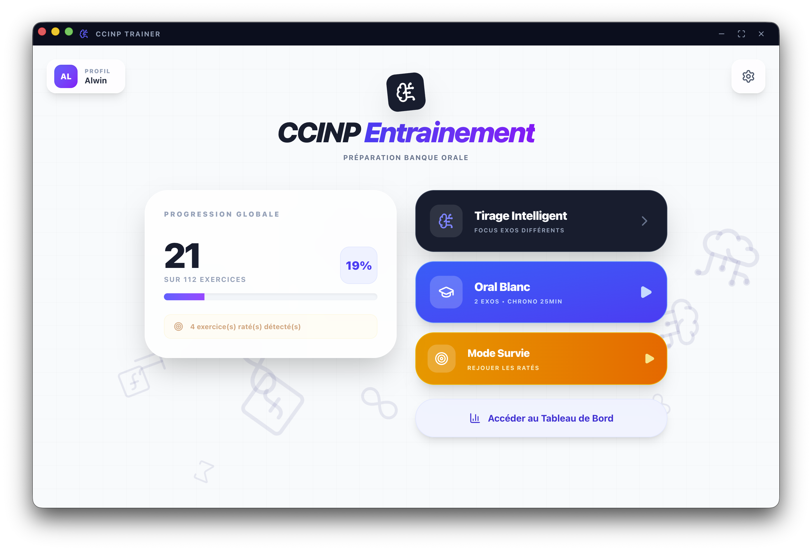

# CCINP Trainer 🎯



> Une solution complète (Script d'extraction LaTeX + Application de bureau) conçue pour améliorer la préparation aux oraux de mathématiques des concours CCINP (Filières MP / MPI).

---

## 📋 Sommaire

1. [💡 Le Problème & La Solution](#-le-problème--la-solution)
2. [📂 Structure du dépôt](#-structure-du-dépôt)
3. [🛠️ Étape 1 : Génération de la banque PDF](#-étape-1--génération-de-la-banque-pdf)
4. [🚀 Étape 2 : L'Application de Bureau](#-étape-2--lapplication-de-bureau)
5. [📦 Compiler l'application](#-compiler-lapplication-pour-lutiliser-tous-les-jours)
6. [✨ Fonctionnalités de l'application](#-fonctionnalités-de-lapplication)

---

## 💡 Le Problème & La Solution

**Le contexte :** La banque d'exercices officielle des oraux CCINP est distribuée sous la forme d'un document LaTeX/PDF massif de plusieurs centaines de pages. 
**Le problème :** Il est très difficile pour un étudiant de suivre sa progression, de filtrer les exercices déjà maîtrisés de ceux qui posent problème, et de simuler les conditions réelles (chronomètre, tirage au sort).

**La solution CCINP Trainer se divise en deux parties :**
1. **Un script de traitement (`split_latex.js`)** : Il lit le code source officiel, isole chaque exercice, et génère un PDF unique et parfaitement mis en page pour chacun d'eux.
2. **Une application de bureau (`ccinp-app`)** : Une interface moderne (développée avec React et Electron) qui sert de tableau de bord d'entraînement. Elle pioche dans les PDF générés pour créer des sessions de révision intelligentes.

---

## 📂 Structure du dépôt

```text
├── split_latex.js       # Script de découpe et de compilation des PDF
├── banque_orale.tex     # (À ajouter par vos soins) Le fichier LaTeX officiel
└── ccinp-app/           # Code source de l'application de bureau
```

---

## 🛠️ Étape 1 : Génération de la banque PDF

Le script `split_latex.js` va automatiser la création des "flashcards" PDF. Il injecte des commandes spécifiques (comme `adjustbox`) pour forcer n'importe quel exercice, quelle que soit sa longueur, à tenir sur une seule page au format paysage.

### Prérequis
Pour faire fonctionner cette partie, vous avez besoin de deux outils gratuits :
1. **Node.js** : Téléchargez et installez la version LTS depuis [nodejs.org](https://nodejs.org/).
2. **Une distribution LaTeX** (pour compiler les PDF) :
   - **Sur Windows :** Installez [MiKTeX](https://miktex.org/download).
   - **Sur macOS :** Installez [MacTeX](https://tug.org/mactex/) (via le site ou via Homebrew : `brew install --cask mactex`).

### Instructions
1. Placez le fichier [source officiel](https://www.concours-commun-inp.fr/fr/epreuves/les-epreuves-orales.html) `banque_orale.tex` à la racine de ce dossier (au même niveau que `split_latex.js`).
2. Ouvrez un terminal dans ce dossier.
3. Lancez la commande suivante :
   ```bash
   node split_latex.js
   ```
4. Laissez le script travailler. Il va créer un dossier `data/exercices/` contenant tous les PDF classés par matière (Analyse, Algèbre, Probabilités).

---

## 🚀 Étape 2 : L'Application de Bureau

L'application est construite avec **Electron** (qui permet de faire des applications bureau) et **React** (pour l'interface utilisateur).

### Installation et test local
1. Ouvrez un terminal dans le sous-dossier de l'application :
   ```bash
   cd ccinp-app
   npm install
   ```
2. Lancez l'application en mode développement pour la tester :
   ```bash
   npm run dev
   ```
   *Note : Au premier lancement, allez dans les paramètres (l'engrenage) et cliquez sur "Importer la banque PDF" en sélectionnant le dossier `exercices` généré à l'Étape 1.*

---

## 📦 Compiler l'application (Pour l'utiliser tous les jours)

Vous pouvez transformer ce code en un véritable logiciel installable (`.exe` pour Windows, `.app` / `.dmg` pour Mac). 
Assurez-vous d'être dans le dossier `ccinp-app` dans votre terminal.

### 🍎 Pour macOS
Exécutez la commande suivante :
```bash
npm run build:mac
```
Le fichier `.dmg` d'installation sera créé dans le dossier `ccinp-app/dist/`. 
*(L'application est compilée en mode "Universel", elle fonctionnera donc parfaitement sur les vieux Mac Intel et les nouveaux Mac avec puces M1/M2/M3).*

> **⚠️ Contourner le blocage de sécurité macOS (Gatekeeper) :**
> L'application n'étant pas signée par un compte développeur Apple payant, votre Mac bloquera la première ouverture.
> 1. Glissez l'application dans votre dossier **Applications**.
> 2. Faites un **Clic Droit** (ou Contrôle+Clic) sur l'icône de l'application.
> 3. Cliquez sur **Ouvrir**. Un message d'avertissement apparaîtra, cliquez à nouveau sur **Ouvrir**. 
> *Cette manipulation n'est à faire qu'une seule fois.*

### 🪟 Pour Windows
Exécutez la commande suivante :
```bash
npm run build:win
```
Le fichier exécutable `.exe` sera créé dans le dossier `ccinp-app/dist/`. Double-cliquez dessus pour l'installer. Si Windows Defender affiche un écran bleu "Windows a protégé votre ordinateur", cliquez sur **Informations complémentaires** puis sur **Exécuter quand même**.

---

## ✨ Fonctionnalités de l'application

* **Profils multiples :** Partagez l'application ou utilisez le mode "Invité" qui ne sauvegarde rien.
* **Objectif Jour J :** Renseignez la date de votre oral pour obtenir un objectif quotidien d'exercices à maîtriser (note ≥ 6/7).
* **Modes d'entraînement tactiques :**
  * *Tirage Intelligent* : Ne propose que des exercices que vous n'avez jamais vus.
  * *Mode Anki (Répétition espacée)* : Priorise automatiquement les exercices ayant reçu une mauvaise note ou qui n'ont pas été revus depuis longtemps pour optimiser la mémoire à long terme.
  * *Mode Blitz* : Entraînement contre-la-montre (5, 8 ou 10 minutes par exercice) pour forcer la recherche rapide et l'élaboration de plans d'attaque sous pression.
  * *Mode Survie* : Ne propose que les exercices où votre note précédente était inférieure ou égale à 3.
  * *Oral Blanc* : Tire 1 exercice d'Analyse + 1 exercice d'Algèbre/Proba et lance un compte à rebours critique de 25 minutes.
  * *Mode Personnalisé* : Créez votre session sur mesure grâce à des filtres ultra-précis (matières ciblées, statut, et sélection libre des notes à retravailler via une palette de couleurs interactive).
* **Système d'astuces :** Un bloc-notes intégré permet d'écrire et de sauvegarder automatiquement les pièges à éviter pour chaque exercice.
* **Dashboard Analytique :** Heatmap de régularité, temps d'investissement total et répartition détaillée de l'aisance par exercice.
